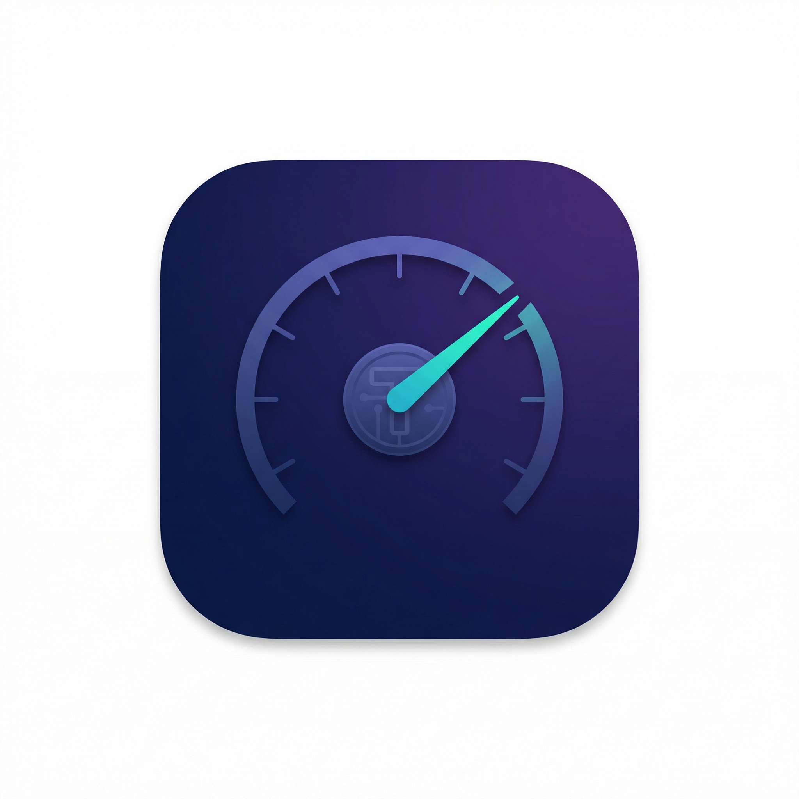

<p align="center">
  
</p>

<h1 align="center">Tokmon</h1>

<p align="center">
  <strong>Monitor your Claude Code token usage and costs — native macOS app</strong>
</p>

<p align="center">
  
  
  
</p>

---

Tokmon reads Claude Code's local JSONL session files and gives you a clear picture of your token consumption, costs, cache efficiency, and model usage — all in a native SwiftUI interface.

## Features

- **Dashboard** — Summary cards (total cost, tokens, cache hit rate, sessions), daily usage bar chart, model distribution pie chart
- **Projects** — Stacked area chart by project, sortable project table with expandable session details
- **Models** — Cost breakdown and token distribution per model, detailed stats cards
- **Sessions** — Searchable/sortable session list, detailed session view with token timeline, activity log
- **Custom Date Range** — Quick presets (7D/14D/30D/All) + custom date picker
- **Editable Pricing** — Customize per-model token pricing in Settings
- **Bilingual** — English / 中文 switchable
- **Dark/Light Theme** — Follows system or manual override

## Requirements

- macOS 14.0 (Sonoma) or later
- Xcode 16+ (for building)
- [XcodeGen](https://github.com/yonaskolb/XcodeGen) (for generating the Xcode project)

## Build & Run

```bash
# Install XcodeGen if needed
brew install xcodegen

# Clone the repo
git clone https://github.com/YOUR_USERNAME/Tokmon.git
cd Tokmon

# Generate Xcode project
xcodegen generate

# Build and run
open Tokmon.xcodeproj
# Press Cmd+R in Xcode
```

Or build from command line:

```bash
xcodegen generate
xcodebuild -project Tokmon.xcodeproj -scheme Tokmon -configuration Release build
```

## How It Works

Tokmon reads JSONL files from `~/.claude/projects/` — the same data Claude Code writes locally during your sessions. No network requests, no API keys needed. Everything stays on your machine.

Data extracted from each session:
- Token usage per API call (input, output, cache write, cache read)
- Model used (Opus, Sonnet, Haiku, etc.)
- Session metadata (project path, git branch, timestamps)
- Tool usage (Bash, Read, Grep, etc.)

## Pricing

Default pricing follows [Anthropic's official rates](https://docs.anthropic.com/en/docs/about-claude/pricing):

| Model | Input | Output | Cache Write (5m) | Cache Read |
|-------|-------|--------|-----------------|------------|
| Opus 4.6 | $5/MTok | $25/MTok | $6.25/MTok | $0.50/MTok |
| Sonnet 4.6 | $3/MTok | $15/MTok | $3.75/MTok | $0.30/MTok |
| Haiku 4.5 | $1/MTok | $5/MTok | $1.25/MTok | $0.10/MTok |

You can customize pricing for any model in Settings.

## Project Structure

```
Tokmon/
├── TokmonApp.swift              # App entry point
├── ContentView.swift            # Sidebar navigation
├── Models/
│   └── DataModels.swift         # Data models + pricing
├── Services/
│   ├── AppState.swift           # Global state
│   ├── JSONLParser.swift        # JSONL file parser
│   ├── StatsEngine.swift        # Aggregation engine
│   └── L10n.swift               # Localization
└── Views/
    ├── Components/              # Shared UI components
    ├── Dashboard/               # Dashboard + charts
    ├── Models/                  # Model breakdown
    ├── Projects/                # Project breakdown
    ├── Sessions/                # Session list + detail
    └── Settings/                # Preferences
```

## License

[MIT](LICENSE)
